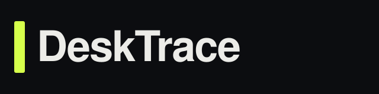

# DeskTrace

<p>
  
</p>

Local-first desktop time machine.

**Stack: Tauri 2 + Rust.** Capture apps, screenshot, clipboard, and opt-in browser tabs. Restore later. Nothing leaves the machine.

Python under `app/` is the discarded overnight prototype. Do not treat it as the product.

Repo: https://github.com/Steeve-Crypto/desktrace

## Why this exists

Windows hibernation saves everything but only at shutdown. PowerToys Workspaces relaunches apps but loses the moment. DeskTrace is lightweight checkpoints: searchable, private, native.

## Product stack

```
src-tauri/          Rust + Tauri 2 native app
  src/capture.rs    processes, clipboard, screenshot
  src/store.rs      SQLite under ~/.desktrace
  src/tabs.rs       http(s) only sanitizer
  src/server.rs     127.0.0.1:8741 for the Chrome/Edge extension
  src/tray.rs       system tray + hide-on-close
static/             timeline UI loaded in the webview
extension/          MV3 companion — localhost only, no profile scrape
brand/              logo + wordmark
```

## Quick start (the real app)

On the Windows laptop:

```bash
rustup default stable
cargo install tauri-cli --version "^2" --locked
cd desktrace
cargo tauri dev
```

Build an installer:

```bash
cargo tauri build
```

The app window loads `static/`. A loopback server still binds `127.0.0.1:8741` so the existing unpacked extension keeps working.

### Tray + hotkey (issue #1)

- Closing the window hides to the tray. It does not quit.
- Tray menu: Capture now, Open timeline, Hide window, Quit DeskTrace
- Left-click tray icon toggles the timeline. Double-click shows it.
- Ctrl+Shift+S captures without opening the window.
- Do not use pystray. The product is the Tauri process.

## Privacy rule

- Bind: `127.0.0.1` only
- No analytics, no upload path
- Tabs only from the installed extension, http/https titles+URLs, 120s cache
- Delete removes the SQLite row and the JPEG

## Browser tabs

Load `extension/` unpacked. It POSTs to `http://127.0.0.1:8741/api/tabs`.

## License

MIT.
